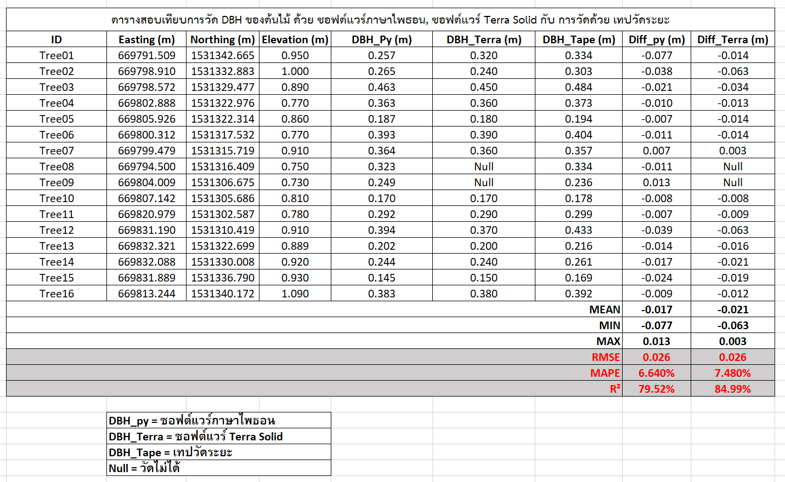

# 🌳 Tree DBH Detection with Forked Trees (Python + Open3D)

This project detects tree Diameter at Breast Height (DBH) from HLS-derived point clouds using Python, Open3D, and ellipse fitting. 
It also handles forked trees (multi stems) automatically.

## 📂 Features
- Ground normalization
- DBH slice extraction at 1.3m
- DBSCAN clustering
- Fork detection per cluster
- Ellipse fitting and DBH calculation
- Exports PLY, PNG, and CSV summary

## 🖥 Example Output

## 📂 Data Access
Due to large file size, the point cloud data is available via Google Drive link below:

👉 [Download Point Cloud Data (LAS file)](https://drive.google.com/file/d/1xSmjEA6SlHddz-mSbJpOKHT-LBwIev0-/view?usp=sharing)

*Note: The data is for academic use only.*

## 📜 License
MIT License or CC BY 4.0

## ✍ Developed by AODM | March 2025
