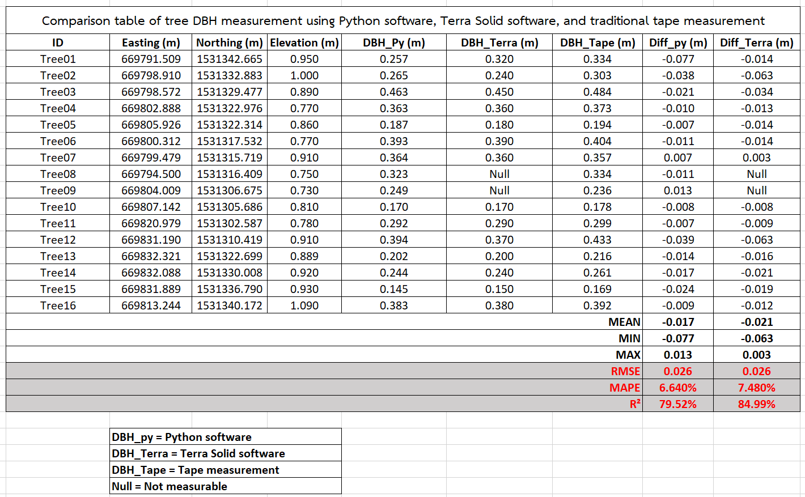

# 🌳 Tree DBH Detection with Forked Trees (Python + Open3D)

This project detects tree Diameter at Breast Height (DBH) from UAV-derived point clouds using Python, Open3D, and ellipse fitting. 
It also handles forked trees (multi stems) automatically.

## 📂 Features
- Ground normalization
- DBH slice extraction at 1.3m
- DBSCAN clustering
- Fork detection per cluster
- Ellipse fitting and DBH calculation
- Exports PLY, PNG, and CSV summary

## 🖥 Example Output

## 📜 License
MIT License or CC BY 4.0

## ✍ Developed by AODM | March 2025
